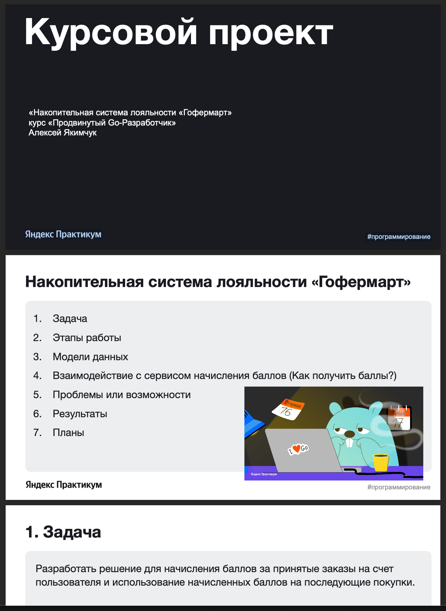
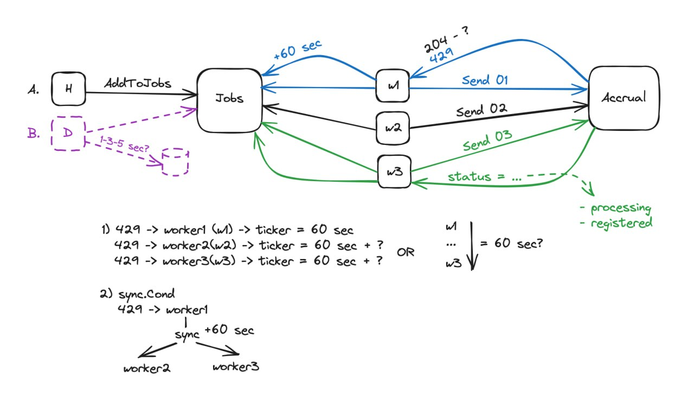
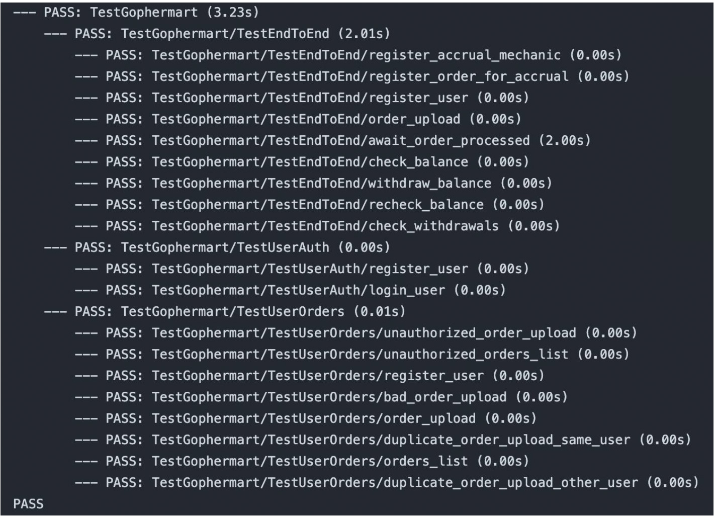

# Накопительная система лояльности "Гофермарт"

Это первый курсовой проект, который требовалось выполнить и сдать в срок в рамках обучения по программе "Продвинутый Go-разработчик" на Яндекс.Практикуме. По данной работе сделана и проведена [презентация](gophermart.pdf) перед авторами и менторами данного курса 13 марта 2024 года.

# Начало работы

Техническое задание ([SPECIFICATION.md](SPECIFICATION.md))

В процессе проработки решения мной сделана схема наиболее сложного участка решения:

# Прохождение тестов

Все автоматические тесты для работы пройдены успешно.

